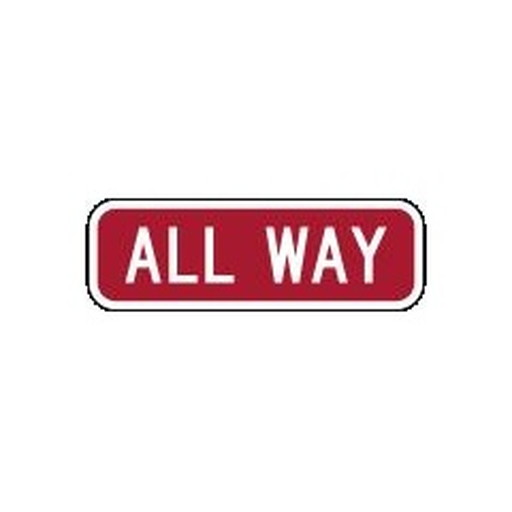
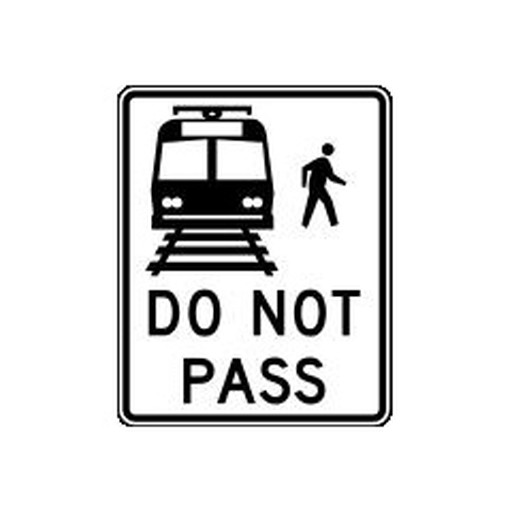
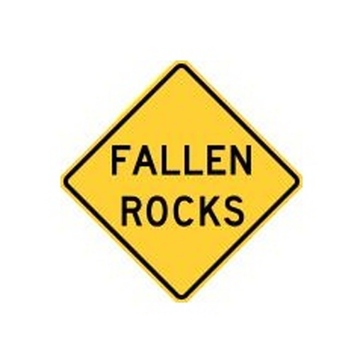
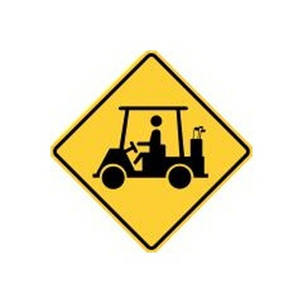
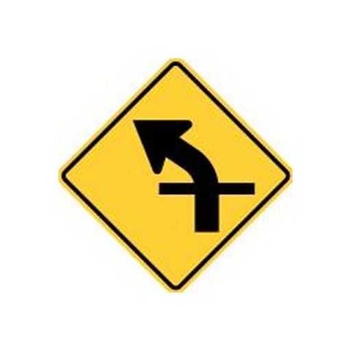
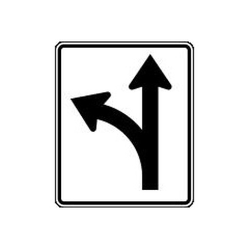
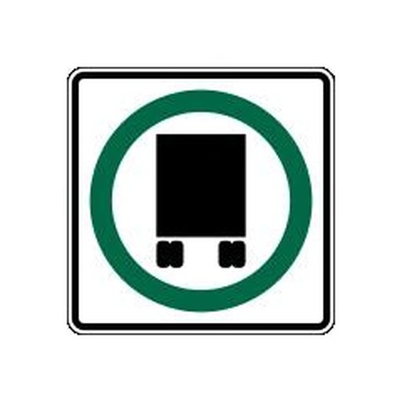
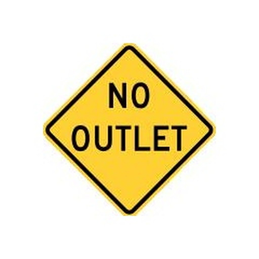
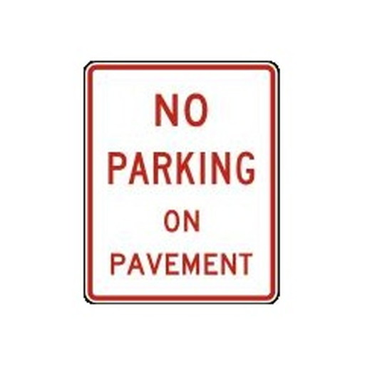
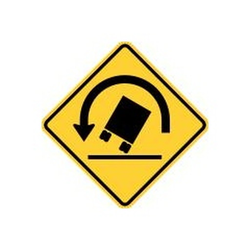

<h1> YOLO_USA_RoadSigns</h1>
<h2> USA RoadSigns</h2>
This is a USA RoadSigns dataset annotated by YOLO format. It contains 154 classes,and each image size is 512x512.

This dataset is created based on <a href="https://en.wikipedia.org/wiki/Road_signs_in_the_United_States">Road signs in the United States.</a>  
The master images are augmented by using <a href="https://www.tensorflow.org/api_docs/python/tf/keras/preprocessing/image/ImageDataGenerator">ImageDataGenerator Tool of Tensorflow-Keras.</a>
 
 
See also: 

<a href="https://mutcd.fhwa.dot.gov/services/publications/fhwaop02084/index.htm">
Manual on Uniform Traffic Control Devices(MUTCD)
</a>
 

 
<h2>Images of Base USA RoadSigns</h2>
Taken from <a href="https://en.wikipedia.org/wiki/Road_signs_in_the_United_States">Road signs in the United States.</a>.
 

<table>
<tr>
<td>  270_degree_loop</td>
<td>  Added_lane</td>
<td>  Added_lane_from_entering_roadway</td>
</tr>
<tr>
<td>  All_way</td>
<td>  Be_prepared_to_stop</td>
<td>  Bicycles</td>
</tr>
<tr>
<td>  Bicycles_and_pedestrians</td>
<td>  Bicycles_left_pedestrians_right</td>
<td>  Bicycle_wrong_way</td>
</tr>
<tr>
<td>  Bike_lane</td>
<td>  Bike_lane_slippery_when_wet</td>
<td>  Bump</td>
</tr>
<tr>
<td>  Bus_lane</td>
<td>  Center_lane</td>
<td>  Chevron_alignment</td>
</tr>
<tr>
<td>  Circular_intersection_warning</td>
<td>  Cross_roads</td>
<td>  Curve</td>
</tr>
<tr>
<td>  Dead_end</td>
<td>  Deer_crossing</td>
<td>  Detour</td>
</tr>
<tr>
<td>  Detour_right</td>
<td>  Dip</td>
<td>  Double_side_roads</td>
</tr>
<tr>
<td>  Do_not_drive_on_tracks</td>
<td>  Do_not_enter</td>
<td>  Do_not_pass_stopped_trains</td>
</tr>
<tr>
<td>  Emergency_signal</td>
<td>  End_detour</td>
<td>  Except_right_turn</td>
</tr>
<tr>
<td>  Fallen_rocks</td>
<td>  Flagger_present</td>
<td>  Fog_area</td>
</tr>
<tr>
<td>  Golf_cart_crossing</td>
<td>  Go_on_slow</td>
<td>  Gusty_winds_area</td>
</tr>
<tr>
<td>  Hairpin_curve</td>
<td>  Hazardous_material_prohibited</td>
<td>  Hazardous_material_route</td>
</tr>
<tr>
<td>  Hidden_driveway</td>
<td>  Hill_bicycle</td>
<td>  Horizontal_alignment_intersection</td>
</tr>
<tr>
<td>  Horse_drawn_vehicle_ahead</td>
<td>  Keep_left</td>
<td>  Keep_left_2</td>
</tr>
<tr>
<td>  Keep_right</td>
<td>  Keep_right_2</td>
<td>  Lane_ends</td>
</tr>
<tr>
<td>  Left_lane</td>
<td>  Left_turn_only</td>
<td>  Left_turn_or_straight</td>
</tr>
<tr>
<td>  Left_turn_yield_on_green</td>
<td>  Loading_zone</td>
<td>  Low_clearance</td>
</tr>
<tr>
<td>  Low_ground_clearance_railroad_crossing</td>
<td>  Merge</td>
<td>  Merging_traffic</td>
</tr>
<tr>
<td>  Metric_low_clearance</td>
<td>  Minimum_speed_limit_40</td>
<td>  Minimum_speed_limit_60km</td>
</tr>
<tr>
<td>  Narrow_bridge</td>
<td>  National_network_prohibited</td>
<td>  National_network_route</td>
</tr>
<tr>
<td>  Night_speed_limit_45</td>
<td>  Night_speed_limit_70km</td>
<td>  No_bicycles</td>
</tr>
<tr>
<td>  No_entre</td>
<td>  No_hitch_hiking</td>
<td>  No_horseback_riding</td>
</tr>
<tr>
<td>  No_large_trucks</td>
<td>  No_left_or_u_turn</td>
<td>  No_left_turn</td>
</tr>
<tr>
<td>  No_left_turn_across_tracks</td>
<td>  No_outlet</td>
<td>  No_parking</td>
</tr>
<tr>
<td>  No_parking_bus_stop</td>
<td>  No_parking_from_830am_to_530pm</td>
<td>  No_parking_from_830am_to_530pm_2</td>
</tr>
<tr>
<td>  No_parking_in_fire_lane</td>
<td>  No_parking_Loading_zone</td>
<td>  No_parking_on_pavement</td>
</tr>
<tr>
<td>  No_pedestrians</td>
<td>  No_pedestrian_crossing</td>
<td>  No_right_turn</td>
</tr>
<tr>
<td>  No_rollerblading</td>
<td>  No_standing_any_time</td>
<td>  No_stopping_on_pavement</td>
</tr>
<tr>
<td>  No_straight_through</td>
<td>  No_train_horn_warning</td>
<td>  No_turns</td>
</tr>
<tr>
<td>  No_unauthorized_vehicles</td>
<td>  No_u_turn</td>
<td>  Offset_roads</td>
</tr>
<tr>
<td>  One_direction</td>
<td>  One_way</td>
<td>  Parking_with_time_restrictions</td>
</tr>
<tr>
<td>  Pass_on_either_side</td>
<td>  Pass_road</td>
<td>  Path_narrows</td>
</tr>
<tr>
<td>  Pedestrian_crossing</td>
<td>  Railroad_crossing</td>
<td>  Railroad_crossing_ahead</td>
</tr>
<tr>
<td>  Railroad_intersection_warning</td>
<td>  Ramp_narrows</td>
<td>  Reserved_parking_wheelchair</td>
</tr>
<tr>
<td>  Reverse_curve</td>
<td>  Reverse_turn</td>
<td>  Right_lane</td>
</tr>
<tr>
<td>  Right_turn_only</td>
<td>  Right_turn_or_straight</td>
<td>  Road_closed</td>
</tr>
<tr>
<td>  Road_closed_ahead</td>
<td>  Road_narrows</td>
<td>  Road_slippery_when_wet</td>
</tr>
<tr>
<td>  Rough_road</td>
<td>  Runaway_vehicles_only</td>
<td>  School</td>
</tr>
<tr>
<td>  School_advance</td>
<td>  School_bus_stop_ahead</td>
<td>  School_bus_turn_ahead</td>
</tr>
<tr>
<td>  School_speed_limit_ahead</td>
<td>  Sharp_turn</td>
<td>  Side_road_at_an_acute_angle</td>
</tr>
<tr>
<td>  Side_road_at_a_perpendicular_angle</td>
<td>  Single_lane_shift_left</td>
<td>  Skewed_railroad_crossing</td>
</tr>
<tr>
<td>  Snowmobile</td>
<td>  Speed_limit_50</td>
<td>  Speed_limit_80km</td>
</tr>
<tr>
<td>  Stay_in_lane</td>
<td>  Steep_grade</td>
<td>  Steep_grade_percentage</td>
</tr>
<tr>
<td>  Stop</td>
<td>  Stop_here_for_pedestrians</td>
<td>  Stop_here_for_peds</td>
</tr>
<tr>
<td>  Straight_ahead_only</td>
<td>  Tractor_farm_vehicle_crossing</td>
<td>  Tractor_farm_vehicle_crossing_2</td>
</tr>
<tr>
<td>  Truck_crossing</td>
<td>  Truck_crossing_2</td>
<td>  Truck_rollover_warning</td>
</tr>
<tr>
<td>  Truck_route_sign</td>
<td>  Truck_speed_Limit_40</td>
<td>  Turning_vehicles_yield_to_pedestrians</td>
</tr>
<tr>
<td>  Turn_only_lanes</td>
<td>  Two_direction</td>
<td>  Two_way_traffic</td>
</tr>
<tr>
<td>  T_roads</td>
<td>  Wait_on_stop</td>
<td>  Weight_limit_10t</td>
</tr>
<tr>
<td>  Winding_road</td>
<td>  Workers_on_road</td>
<td>  Work_zone_for_speed_limit</td>
</tr>
<tr>
<td>  Wrong_way</td>
<td>  Yield</td>
<td>  Yield_here_to_pedestrians</td>
</tr>
<tr>
<td>  Yield_here_to_peds</td>
<td>  Y_roads</td>
</tr>
</table>

 

<h2>153 Classes of USA RoadSigns</h2>
<pre>
270_degree_loop
Added_lane
Added_lane_from_entering_roadway
All_way
Be_prepared_to_stop
Bicycles
Bicycles_and_pedestrians
Bicycles_left_pedestrians_right
Bicycle_wrong_way
Bike_lane
Bike_lane_slippery_when_wet
Bump
Bus_lane
Center_lane
Chevron_alignment
Circular_intersection_warning
Cross_roads
Curve
Dead_end
Deer_crossing
Detour
Detour_right
Dip
Double_side_roads
Do_not_drive_on_tracks
Do_not_enter
Do_not_pass_stopped_trains
Emergency_signal
End_detour
Except_right_turn
Fallen_rocks
Flagger_present
Fog_area
Golf_cart_crossing
Go_on_slow
Gusty_winds_area
Hairpin_curve
Hazardous_material_prohibited
Hazardous_material_route
Hidden_driveway
Hill_bicycle
Horizontal_alignment_intersection
Horse_drawn_vehicle_ahead
Keep_left
Keep_right
Lane_ends
Left_lane
Left_turn_only
Left_turn_or_straight
Left_turn_yield_on_green
Loading_zone
Low_clearance
Low_ground_clearance_railroad_crossing
Merge
Merging_traffic
Metric_low_clearance
Minimum_speed_limit_40
Minimum_speed_limit_60km
Narrow_bridge
National_network_prohibited
National_network_route
Night_speed_limit_45
Night_speed_limit_70km
No_bicycles
No_entre
No_hitch_hiking
No_horseback_riding
No_large_trucks
No_left_or_u_turn
No_left_turn
No_left_turn_across_tracks
No_outlet
No_parking
No_parking_bus_stop
No_parking_from_830am_to_530pm
No_parking_in_fire_lane
No_parking_Loading_zone
No_parking_on_pavement
No_pedestrians
No_pedestrian_crossing
No_right_turn
No_rollerblading
No_standing_any_time
No_stopping_on_pavement
No_straight_through
No_train_horn_warning
No_turns
No_unauthorized_vehicles
No_u_turn
Offset_roads
One_direction
One_way
Parking_with_time_restrictions
Pass_on_either_side
Pass_road
Path_narrows
Pedestrian_crossing
Railroad_crossing
Railroad_crossing_ahead
Railroad_intersection_warning
Ramp_narrows
Reserved_parking_wheelchair
Reverse_curve
Reverse_turn
Right_lane
Right_turn_only
Right_turn_or_straight
Road_closed
Road_closed_ahead
Road_narrows
Road_slippery_when_wet
Rough_road
Runaway_vehicles_only
School
School_advance
School_bus_stop_ahead
School_bus_turn_ahead
School_speed_limit_ahead
Sharp_turn
Side_road_at_an_acute_angle
Side_road_at_a_perpendicular_angle
Single_lane_shift_left
Skewed_railroad_crossing
Snowmobile
Speed_limit_50
Speed_limit_80km
Stay_in_lane
Steep_grade
Steep_grade_percentage
Stop
Stop_here_for_pedestrians
Stop_here_for_peds
Straight_ahead_only
Tractor_farm_vehicle_crossing
Truck_crossing
Truck_rollover_warning
Truck_route_sign
Truck_speed_Limit_40
Turning_vehicles_yield_to_pedestrians
Turn_only_lanes
Two_direction
Two_way_traffic
T_roads
Wait_on_stop
Weight_limit_10t
Winding_road
Workers_on_road
Work_zone_for_speed_limit
Wrong_way
Yield
Yield_here_to_pedestrians
Yield_here_to_peds
Y_roads

</pre>
 
 

